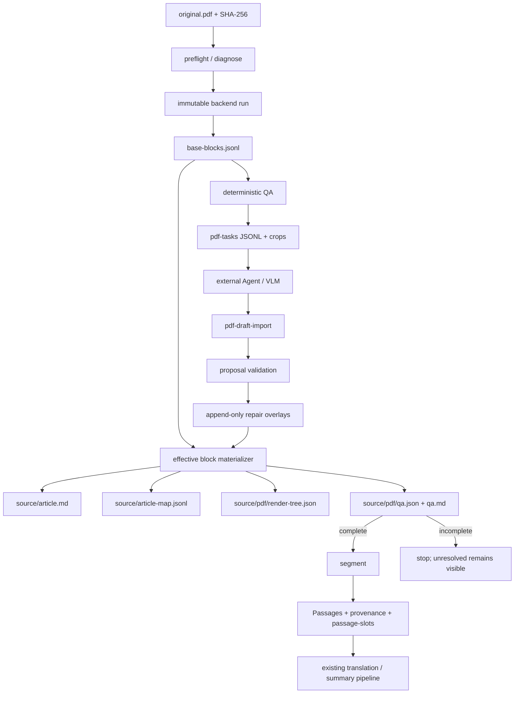

# PaperWeaver 期刊 PDF → 规整 Markdown 导入设计

状态：已批准；P0 安全地基、P1a、P2 结构 plumbing 与 P3 确定性公式核心已实现；P1 真实语料语义验收、P3 Agent repair、P4 OCR engine、P5 可选后端待收口  
目标版本：v0.5+，分期交付  
最后复核：2026-08-25  

P1a 实现了不可变原件、稳定 run/block/object 身份、带摘要的字符/块/关系/对象账本、局部一/二栏文本顺序、重复页眉页码排除、逐页可见 ink component QA、规整审阅 Markdown、完整性门禁和 Passage provenance。P2 已实现 cluster-first figure asset、caption 分块与显式 `caption_of` 关系、闭合有框表验证、table-cell Passage、passage-slot map、render-tree 译文回填、asset 复制与 A4 表格渲染；无框/span 表和 captionless/歧义图簇仍走诚实 bbox crop。P3 确定性核心已能把文本层主行、下标、续行及右侧编号一一归属并生成 verified LaTeX/crop；复杂、位图、混合对象或含未支持 TeX glyph 的公式保持 unresolved。P1 的 shortest-edit JATS 语义门禁和真实 complete corpus 仍待收口；QA 现输出 OCR page/block candidates，但 P4 OCR 引擎和 append-only supplement run 尚未实现。

## 0. 摘要与最终拍板

本设计为 PaperWeaver 增加以下入口：

```text
paperweaver import my-paper paper.pdf
```

对受支持的 born-digital 期刊 PDF，该命令保存不可变的 `original.pdf`，生成可审计的块账本、规整的 `source/article.md`、Markdown 行到 PDF 坐标的映射，以及机器可读和人可读的 QA 报告。只有 QA 达到 `complete`，现有 `segment → Passage → translation/summary` 管线才允许继续。

八个开放问题的结论如下：

| 问题 | 决策 |
| --- | --- |
| PyMuPDF / pdfplumber | `pdfplumber` 是默认规范 backend；PyMuPDF 仅作显式可选辅助，不静默覆盖规范文本 |
| 图片是否入项目 | 是。原 PDF 与必要的图、表、公式裁剪图进入 `source/`，按内容寻址并单独校验摘要 |
| MinerU / Marker / Docling | Docling 是首个 experimental optional backend；MinerU/Marker 先作为参考或用户自管的 external-command backend |
| Markdown 公式/表格等 | 公式采用“验证后的 LaTeX + 永存裁剪图”双轨；表格按 pipe → HTML → 图片兜底；脚注用 Markdown footnote；交叉引用保持原文 |
| Block 与 Passage ID | 两套 ID，不复用；用显式、多对多 `passage-provenance.jsonl` 连接 |
| P1 覆盖范围 | 横排、LTR、1–2 栏、可用文本层的标准期刊 PDF；扫描、坏 ToUnicode、复杂/旋转/三栏正文等提前判为 unsupported 或 incomplete |
| QA 阈值 | 版本化 JSON policy；致命错误拒绝导入，未解决内容允许生成审阅物但禁止 `segment`，其余为 warning |
| skill 边界 | skill 只编排任务、调用外部模型、提交严格草稿；检测、裁剪、schema、合并、物化、QA 和门禁全部属于 CLI |

这里对简报中的三项表述作必要修正：

1. **原始 PDF 才是证据源。** `blocks` 是某个明确 extractor/config 对原 PDF 的“规范化派生账本”，不是论文事实本身。否则会违反仓库“保留导入源及其 digest”的纪律。
2. **可兑现的目标是零静默丢失，而不是对任意 PDF 承诺自动恢复全部语义。** 每个检测到的对象必须被标为 rendered、excluded-artifact 或 unresolved；任何 unresolved 都会阻止后续管线。
3. **“PyMuPDF / pdfplumber 都是轻量纯 Python”不成立。** PyMuPDF 是 MuPDF 原生绑定，采用 AGPL/商业双许可；现代 pdfplumber 也依赖 Pillow 和 pypdfium2。PDF 能力应放在 extras，而不是污染当前默认运行依赖。

## 1. 目标、规整定义与非目标

### 1.1 目标

1. 接受受支持的期刊 PDF，并完整保存原始 bytes 与 SHA-256。
2. 把每页内容转成有页码、bbox、类型、置信度和处置状态的块序列。
3. 从已验证块确定性生成通畅、结构清楚、可继续分段的 Markdown。
4. 对每次规范化操作保留变换账本，能够解释字符为何合并、换序、去页眉或修复断词。
5. 无法可靠恢复的内容保留裁剪图、原始提取文本和明确占位符，并进入 QA。
6. 弱模型只能提交受限提案；提案不能直接改 base blocks 或 `article.md`。
7. 对相同 PDF、相同 backend 版本、相同 policy 产生字节稳定的 blocks、Markdown 和 QA（时间戳除外，时间戳不进入 golden 输出）。

### 1.2 “规整 Markdown”规范性定义

一份 PDF 导入只有同时满足以下条件才是 `complete`：

- 文档只有一个 H1；章节层级连续且不凭空改名。
- 正文阅读顺序通过版式门禁；不残留栏间跳读、重复页眉页脚或页码。
- 同一逻辑段落无版式硬换行；跨页续段已合并；允许的断词修复均有账本。
- 作者、单位、摘要、keywords、正文、图、表、公式、脚注、参考文献都有明确块类型和位置。
- 每个非 artifact source object 恰好映射到 rendered 或 unresolved 内容；不得无处置消失。
- 所有 Markdown 块都能反查一个或多个 `block_id`，进而反查 PDF `page + bbox`。
- 所有本地资源引用存在、摘要匹配且路径不逃逸工作区。
- 所有 `status=unresolved` 的块数量为 0；`flagged` 只有在可见字符、阅读顺序、元素边界和 Passage section 均不受影响时才可作为 warning 存在，否则同样阻止 complete。
- `source/article.md` 能被更新后的 `segment` 稳定解析，且同一物化版本重复分段得到相同 Passage ID。

这一定义不要求复刻期刊分页、字体、栏宽或装饰；它要求内容、顺序、结构和溯源可审计。

### 1.3 非目标

- 期刊页面的像素级复刻或版式保持。
- 从论文内容推断缺失的作者、结论、公式、引用或表格单元格。
- 在 PaperWeaver 进程内调用在线 LLM/VLM provider。
- 让第三方 backend 的 Markdown 直接成为 `source/article.md`。
- P1 自动链接 Fig./Table/Eq. 交叉引用。
- P1 支持任意语言方向、任意版面和任意损坏 PDF。
- 在已有 Passage/TranslationRecord 后静默重做 PDF repair。

### 1.4 P1 明确 out of scope 的 PDF

以下输入会在诊断层被标为 `unsupported`，而不是生成貌似可用的正文：

- image-only 或扫描页占内容页 5% 以上；P4 才提供 OCR 回退。
- 加密且无法解密、损坏、零页、页面对象无法解析的文件。
- 正文主要是 RTL、竖排、手写、音乐谱、幻灯片、海报或表单。
- 三栏及以上正文页超过 10%，或主要正文有自由浮动/非矩形阅读流。
- 旋转正文字符超过正文字符 2%，或页面旋转无法统一规范化。
- 主要文字在 annotation/form/XObject 中且默认 backend 无法可靠定位。
- 有效 Unicode 字符率低于门槛、ToUnicode 严重损坏或乱码率超限。
- 单页尺寸、页数、解压后对象数超过 policy 资源限制。

“包含公式、图片、表格”本身不使 PDF out of scope；未实现阶段的复杂元素会被保存为裁剪图并使导入 `incomplete`。

诊断错误必须包含稳定 code、实测值、门槛和下一步。例如：

```text
PDF_SCAN_RATIO_UNSUPPORTED: usable text layer found on 82.0% of content pages;
born-digital-journal-v1 requires at least 95.0%. The original PDF was not
materialized as a complete source. Install paperweaver[pdf-ocr] when P4 is
available, or use a born-digital/JATS source.
```

其他稳定 code 至少包括 `PDF_ENCRYPTED`、`PDF_CORRUPT`、`PDF_RESOURCE_LIMIT`、`PDF_TEXT_ENCODING_UNUSABLE`、`PDF_LAYOUT_UNSUPPORTED`、`PDF_BACKEND_MISSING` 和 `PDF_BACKEND_SCHEMA_UNSUPPORTED`。不得只打印第三方库异常栈。

## 2. 与现有仓库的兼容性结论

现有不可破坏的契约是：

- `PaperSource.sha256` 始终是**导入原件 bytes** 的摘要，不是 `article.md` 的摘要。
- `PaperSource.path` 继续指向 `source/article.md`；PDF 的 `original_path` 为 `source/original.pdf`。
- Passage ID 仍由 source digest、section、ordinal、规范化文本构成。
- TranslationRecord 和 ChineseSummaryRecord 继续 append-only；摘要继续只引用 Passage ID。
- `output/` 继续只放用户交付物；PDF 导入证据、QA 和资源放在 `source/` 与 `state/`。

实现 PDF 前必须先修复或隔离四个现有风险：

1. 当前重新导入检查拿 `article.md` bytes 与原件 bytes 比较，归一化 TXT/JATS 已可能误判；新逻辑必须比较 `source.json.sha256`。
2. 当前 structural marker 判断不能正确匹配 `[Figure: ...]` 等实际标记；PDF 不可依赖该判断。
3. 当前 `segment` 会覆盖 passages/units 却保留旧 translation records；PDF 物化必须在首次 `segment` 时冻结。
4. 当前 draft importer 边读边 append，坏行会部分提交；PDF repair 必须先完整校验，再原子追加。

## 3. 架构与数据流

### 3.1 数据流



### 3.2 模块划分

| 文件 | 职责 | 不负责 |
| --- | --- | --- |
| `core.py` | 格式 dispatch、源 digest 冲突保护、导入事务 | PDF 版式算法 |
| `pdf_import.py` | PDF 阶段编排、manifest、freeze 状态 | 供应商模型调用 |
| `pdf_backend.py` | `PdfBackend` protocol、backend run 元数据、坐标标准化 | reading order 决策 |
| `pdf_backend_pdfplumber.py` | 默认字符/对象/表格候选提取 | Markdown 输出 |
| `pdf_layout.py` | 行/段/栏、reading order、页眉脚、标题、脚注候选 | LLM repair |
| `pdf_elements.py` | figure/table/equation/asset 候选及兜底裁剪 | 翻译 |
| `pdf_repairs.py` | 四类 draft schema、幂等导入、append-only overlays | 直接编辑 base blocks |
| `pdf_markdown.py` | effective blocks → Markdown + line map | 重新解析 PDF |
| `pdf_qa.py` | 指标、issue、policy 和 gate | 猜测缺失内容 |
| `models.py` | 新增独立 PDF records | 把 PDF 字段硬塞进 Passage |
| `translation.py` | PDF gate、anchor 解析、Passage↔block map | PDF 提取 |
| `publication.py` | 分期支持新 Markdown 结构和 asset copy | 判断 PDF 内容真伪 |

### 3.3 工作区布局

```text
my-paper/
├── paper.json
├── source/
│   ├── original.pdf
│   ├── source.json
│   ├── inventory.json
│   ├── article.md
│   ├── article-map.jsonl
│   ├── assets/
│   │   ├── sha256-<digest>.png
│   │   └── manifest.jsonl
│   └── pdf/
│       ├── manifest.json
│       ├── policy.json
│       ├── qa.json
│       ├── qa.md
│       ├── render-tree.json
│       └── runs/<run_id>/
│           ├── backend.json
│           ├── raw-objects.jsonl
│           ├── base-blocks.jsonl
│           ├── base-relations.jsonl
│           ├── object-accounting.jsonl
│           └── backend-artifacts/...
├── state/
│   ├── pdf-revisions.jsonl
│   ├── pdf-review-findings.jsonl
│   ├── pdf-review-decisions.jsonl
│   ├── pdf-run-events.jsonl
│   ├── passages.jsonl
│   ├── passage-provenance.jsonl
│   ├── passage-slots.jsonl
│   └── ...
└── output/...
```

`raw-objects.jsonl` 与 `base-blocks.jsonl` 一旦写入不得原地修改。相同输入和配置的重跑按 `run_id` 幂等复用；不同 extractor/config 产生新 run，由 manifest 显式切换，不覆盖旧证据。

`source.json` 保持现有 `PaperSource` 兼容形状：`path=source/article.md`、`format=pdf`、`original_path=source/original.pdf`、`sha256=<PDF bytes>`。PDF 特有的 `status`、active `run_id`、`materialization_id`、`article_sha256`、policy/backend 版本和 `frozen_at` 放在 `source/pdf/manifest.json`，避免旧 JSONL/record reader 因未知字段失效。`inventory.json` 继续填写现有 figure/table/equation/citation/reference 计数；不把 QA issue 塞进 inventory warnings 充当门禁。

### 3.4 可复现 run 身份

所有参与 hash 的 JSON 使用 UTF-8、sorted keys、无无意义空白、禁止 NaN/Infinity；浮点配置先转十进制定点字符串。定义：

```text
run_id = "run_" + sha256(
    source_sha256 + "\x1f" +
    backend_name + "\x1f" + backend_version + "\x1f" +
    canonical_json(backend_options) + "\x1f" +
    policy_sha256 + "\x1f" + adapter_schema_version
)[:16]
```

`source_object_ref` 也不得使用进程内地址或随机 UUID：先把每个 native object 转成 `page, object_kind, bbox(0.001pt), payload_digest, native_ref` 的规范 tuple；按 tuple 排序，对完全相同者增加从 1 开始的 occurrence index，再取 SHA-256。相同 bytes/backend/options 必须产生相同 refs。backend 原生 ref 仅作为审计字段，不单独决定身份。

时间、主机名和绝对路径不进入 run/block/materialization/QA canonical hash。操作时间单独 append 到 `state/pdf-run-events.jsonl`；规范 `qa.json` 不含 `generated_at`，因此 golden 可字节稳定。

### 3.5 CLI 契约

```text
paperweaver import PROJECT PAPER.pdf [--pdf-policy POLICY.json] [--pdf-backend pdfplumber]
paperweaver pdf-status PROJECT [--json]
paperweaver pdf-task-export PROJECT --kind equation|table|decision|visual-review
paperweaver pdf-draft-import PROJECT DRAFT.jsonl --adapter NAME --model NAME
paperweaver pdf-review PROJECT --proposal PROPOSAL_ID --accept|--reject --reviewer NAME
paperweaver pdf-materialize PROJECT
paperweaver pdf-validate PROJECT
```

- `import` complete 或 complete-with-warnings：exit 0。
- 可审阅但 unresolved：提交原件、blocks、Markdown 和 QA，exit 2。
- 有效 PDF 但超出 active policy：提交原件、诊断 QA 和 unresolved review shell，exit 3。
- 非 PDF、损坏或 backend 缺失等无法建立可靠账本：不提交半成品，exit 1；超过 policy 资源上限属于上一条 unsupported。
- 未安装 `[pdf]` 时给出精确提示：`Install paperweaver[pdf] to import PDF sources.`
- 相同 digest 的重复命令幂等；不同 digest 永远拒绝覆盖，要求新项目。
- 一旦 `state/passages.jsonl` 非空，repair/materialize 默认报 `PROJECT_FROZEN`。初版不实现 Passage 迁移；需要修 PDF 时创建新项目。未来迁移必须显式设计。

## 4. 块数据模型

### 4.1 身份与坐标

- `block_id = "blk_" + sha256(source_sha256, run_id, sorted(source_object_refs), quantized_bboxes)[:16]`。
- block ID 不含 repair 后文本；同一 base block 的修订因此保持同一身份。
- bbox 统一为 PDF points、top-left origin、y-down：`[x0, y0, x1, y1]`。
- page 从 1 开始，并记录 page width/height、CropBox、MediaBox、rotation。
- bbox 量化到 0.01 pt 只用于生成 ID；账本保留 backend 原始浮点值和标准化值。
- 一个 block 可有多个 provenance 项，支持跨页段落、组合 figure 和跨栏脚注。

### 4.2 kind 枚举

```text
document_title, author, affiliation, abstract, keywords, metadata,
section_heading, paragraph, list_item,
figure, figure_caption, table, table_caption, equation,
footnote, reference,
header, footer, page_number, marginalia,
unknown
```

`header/footer/page_number` 并非删除，而是以 `disposition=excluded_artifact` 留在账本。`unknown` 必须是 `flagged` 或 `unresolved`。

### 4.3 规范 JSON Schema

下面是 `base-blocks.jsonl` 和 effective block 共用的字段级 schema；每一行是一个独立 JSON object。

```json
{
  "$schema": "https://json-schema.org/draft/2020-12/schema",
  "$id": "https://paperweaver.dev/schema/pdf-block-v1.json",
  "title": "PdfBlockV1",
  "type": "object",
  "additionalProperties": false,
  "required": [
    "schema_version", "block_id", "source_sha256", "run_id", "ordinal",
    "kind", "status", "disposition", "confidence", "provenance",
    "source_object_refs", "raw_text", "text", "metadata_role", "list", "asset_refs",
    "table", "equation", "transformations", "issues", "backend_ref"
  ],
  "properties": {
    "schema_version": {"const": 1},
    "block_id": {"type": "string", "pattern": "^blk_[0-9a-f]{16}$"},
    "source_sha256": {"type": "string", "pattern": "^[0-9a-f]{64}$"},
    "run_id": {"type": "string", "pattern": "^run_[0-9a-f]{16}$"},
    "ordinal": {"type": "integer", "minimum": 1},
    "kind": {
      "enum": [
        "document_title", "author", "affiliation", "abstract", "keywords", "metadata",
        "section_heading", "paragraph", "list_item", "figure", "figure_caption",
        "table", "table_caption", "equation", "footnote", "reference",
        "header", "footer", "page_number", "marginalia", "unknown"
      ]
    },
    "status": {"enum": ["ok", "flagged", "unresolved"]},
    "disposition": {"enum": ["render", "excluded_artifact", "unresolved_placeholder"]},
    "confidence": {
      "type": "object",
      "additionalProperties": false,
      "required": ["overall", "text", "kind", "order"],
      "properties": {
        "overall": {"type": ["number", "null"], "minimum": 0, "maximum": 1},
        "text": {"type": ["number", "null"], "minimum": 0, "maximum": 1},
        "kind": {"type": ["number", "null"], "minimum": 0, "maximum": 1},
        "order": {"type": ["number", "null"], "minimum": 0, "maximum": 1}
      }
    },
    "provenance": {
      "type": "array",
      "minItems": 1,
      "items": {
        "type": "object",
        "additionalProperties": false,
        "required": [
          "page", "bbox", "page_width", "page_height", "media_box",
          "crop_box", "rotation", "coord_space", "origin"
        ],
        "properties": {
          "page": {"type": "integer", "minimum": 1},
          "bbox": {
            "type": "array", "minItems": 4, "maxItems": 4,
            "items": {"type": "number"}
          },
          "page_width": {"type": "number", "exclusiveMinimum": 0},
          "page_height": {"type": "number", "exclusiveMinimum": 0},
          "media_box": {"type": "array", "minItems": 4, "maxItems": 4, "items": {"type": "number"}},
          "crop_box": {"type": "array", "minItems": 4, "maxItems": 4, "items": {"type": "number"}},
          "rotation": {"enum": [0, 90, 180, 270]},
          "coord_space": {"const": "pdf_points"},
          "origin": {"const": "top_left"}
        }
      }
    },
    "source_object_refs": {
      "type": "array", "minItems": 1, "uniqueItems": true,
      "items": {"type": "string"}
    },
    "raw_text": {"type": ["string", "null"]},
    "text": {"type": ["string", "null"]},
    "metadata_role": {
      "type": ["string", "null"],
      "enum": [null, "correspondence", "doi", "dates", "license", "funding", "conflict_of_interest", "data_availability", "article_history", "other"]
    },
    "list": {
      "type": ["object", "null"],
      "additionalProperties": false,
      "required": ["ordered", "level", "marker"],
      "properties": {
        "ordered": {"type": "boolean"},
        "level": {"type": "integer", "minimum": 0, "maximum": 8},
        "marker": {"type": ["string", "null"], "maxLength": 16}
      }
    },
    "asset_refs": {
      "type": "array", "uniqueItems": true,
      "items": {"type": "string", "pattern": "^asset_[0-9a-f]{16}$"}
    },
    "table": {
      "type": ["object", "null"],
      "properties": {
        "rows": {"type": "array", "items": {"type": "array", "items": {"type": "string"}}},
        "row_spans": {
          "type": "array",
          "items": {
            "type": "object", "additionalProperties": false,
            "required": ["row", "column", "span"],
            "properties": {
              "row": {"type": "integer", "minimum": 0},
              "column": {"type": "integer", "minimum": 0},
              "span": {"type": "integer", "minimum": 2}
            }
          }
        },
        "col_spans": {
          "type": "array",
          "items": {
            "type": "object", "additionalProperties": false,
            "required": ["row", "column", "span"],
            "properties": {
              "row": {"type": "integer", "minimum": 0},
              "column": {"type": "integer", "minimum": 0},
              "span": {"type": "integer", "minimum": 2}
            }
          }
        },
        "header_rows": {"type": "integer", "minimum": 0},
        "structure_verified": {"type": "boolean"}
      },
      "required": ["rows", "row_spans", "col_spans", "header_rows", "structure_verified"],
      "additionalProperties": false
    },
    "equation": {
      "type": ["object", "null"],
      "properties": {
        "latex": {"type": ["string", "null"]},
        "number": {"type": ["string", "null"]},
        "latex_verified": {"type": "boolean"}
      },
      "required": ["latex", "number", "latex_verified"],
      "additionalProperties": false
    },
    "transformations": {
      "type": "array",
      "items": {
        "type": "object",
        "additionalProperties": false,
        "required": ["kind", "input_refs", "before", "after", "rule"],
        "properties": {
          "kind": {"enum": ["join_line", "join_page", "dehyphenate", "expand_ligature", "unicode_map", "reorder", "classify"]},
          "input_refs": {"type": "array", "items": {"type": "string"}},
          "before": {"type": "string"},
          "after": {"type": "string"},
          "rule": {"type": "string"}
        }
      }
    },
    "issues": {"type": "array", "items": {"type": "string", "pattern": "^[A-Z][A-Z0-9_]+$"}},
    "backend_ref": {"type": "string"}
  },
  "allOf": [
    {
      "if": {"properties": {"kind": {"const": "table"}}},
      "then": {"properties": {"table": {"type": "object"}}},
      "else": {"properties": {"table": {"type": "null"}}}
    },
    {
      "if": {"properties": {"kind": {"const": "equation"}}},
      "then": {"properties": {"equation": {"type": "object"}, "asset_refs": {"minItems": 1}}},
      "else": {"properties": {"equation": {"type": "null"}}}
    },
    {
      "if": {"properties": {"kind": {"const": "list_item"}}},
      "then": {"properties": {"list": {"type": "object"}}},
      "else": {"properties": {"list": {"type": "null"}}}
    },
    {
      "if": {"properties": {"kind": {"const": "metadata"}}},
      "then": {"properties": {"metadata_role": {"type": "string"}}},
      "else": {"properties": {"metadata_role": {"type": "null"}}}
    }
  ]
}
```

额外语义校验不能只靠 JSON Schema：

- bbox 必须在对应 CropBox 内且面积大于 0。
- `ordinal` 唯一且连续；render blocks 的顺序就是规范阅读顺序。
- text-like kind 必须有 `raw_text` 与 `text`；figure 必须有 asset；所有 display equation 必须有 crop asset，inline equation 可仅有可验证原生文本。
- `excluded_artifact` 只允许 header/footer/page_number/marginalia。
- `status=ok` 不允许有 unresolved issue；`unknown` 不允许 `ok`。
- 所有 raw source object 在 accounting ledger 中恰有一个 primary disposition；同一对象可作为多个 block 的 supporting evidence，但不能被重复计算为内容。
- backend 未给置信度时写 `null`，不得伪造 `1.0`。

### 4.4 Relation 与 object accounting 账本

Block 自身不内嵌任意关系，避免 `additionalProperties=false` 被旁路。`base-relations.jsonl` 使用以下精确记录：

```json
{
  "$schema":"https://json-schema.org/draft/2020-12/schema",
  "type":"object",
  "additionalProperties":false,
  "required":["schema_version","relation_id","type","from_block_ids","to_block_ids","metadata"],
  "properties":{
    "schema_version":{"const":1},
    "relation_id":{"type":"string","pattern":"^rel_[0-9a-f]{16}$"},
    "type":{"enum":["caption_of","note_of","number_of","callout_to","continues","contains","reading_before","duplicate_of","derived_from"]},
    "from_block_ids":{"type":"array","minItems":1,"uniqueItems":true,"items":{"type":"string","pattern":"^blk_[0-9a-f]{16}$"}},
    "to_block_ids":{"type":"array","minItems":1,"uniqueItems":true,"items":{"type":"string","pattern":"^blk_[0-9a-f]{16}$"}},
    "metadata":{"type":"object","additionalProperties":false,"properties":{"label":{"type":["string","null"]},"confidence":{"type":["number","null"],"minimum":0,"maximum":1}},"required":["label","confidence"]}
  }
}
```

`caption_of/note_of/number_of/callout_to/duplicate_of` 必须是一对一；`continues/reading_before` 的合并图必须无环；`contains/derived_from` 可一对多。footnote attachment、figure/table caption、equation number、跨页续段和 duplicate 都只能通过该账本表达。repair relation 作为 append-only overlay 存在 `pdf-revisions.jsonl`，不改 base relation。

`raw-objects.jsonl` 的分母只包括 backend 实际暴露且 bbox 可定位的叶对象：`char, image_occurrence, line, rect, curve, annotation, form_value, xobject_occurrence`。page、font、resource dictionary 等容器/元数据不进入内容分母，但保留在 backend artifact。每个 leaf 有稳定 `object_ref`、kind、page/bbox、payload digest、visibility 和 native ref。

`object-accounting.jsonl` 每个 leaf 恰有一行：

```json
{"schema_version":1,"object_ref":"obj_0123456789abcdef","object_kind":"char","primary_disposition":"rendered","primary_block_id":"blk_0123456789abcdef","supporting_block_ids":[],"duplicate_of":null,"reason_code":null}
```

其中 `primary_disposition` 精确为 `rendered|excluded_artifact|unresolved|duplicate`。`rendered/unresolved` 必须有 `primary_block_id`；`duplicate` 必须有 `duplicate_of`；`excluded_artifact` 必须有 header/footer/page-number 等 reason code。`supporting_block_ids` 可让同一 line/curve 同时支持 table detection 与 figure cluster，但不增加 accounting 分子。由多个 raw objects 派生的 crop 通过 asset manifest 反指这些 objects/bbox。

这只能证明“backend 检测对象零静默丢失”；不能证明 backend 没漏掉 PDF 中可见内容。独立 raster/ink coverage 在 QA 中承担后一层检查。

### 4.5 状态机

```text
base: ok | flagged | unresolved
             |
             v
proposal (append-only, never rendered as truth)
             |
      deterministic validation
        /          \
   rejected      accepted-overlay
                     |
              rematerialize + re-QA
                     |
              ok | flagged | unresolved
```

模型不能把自己的 proposal 标为最终 `ok`。只有 CLI 的确定性规则或单独的人类 approval 能改变 effective 状态；人类 approval 也要成为 append-only record。

### 4.6 Asset 与指纹

PDF 项目明确允许二进制，但分三层：

1. `source/original.pdf`：唯一 source identity，`PaperSource.sha256` 只计算它。
2. `source/assets/sha256-<digest>.<ext>`：提取图片或 300 DPI 无损 PNG crop，文件名按自身 bytes 的 SHA-256 寻址。
3. backend debug render：放在 immutable run 目录，不被 Markdown 直接引用。

`manifest.jsonl` 记录 `asset_id`、完整 SHA-256、MIME、width/height、生成方式（`embedded`, `raster_crop`, `page_render`）、source page/bbox、backend/version。矢量或多对象 figure 即使提取到 embedded image，也必须保留完整 bbox crop，因为单个 image xref 不代表完整 figure。

### 4.7 Block → Passage 映射

Block 和 Passage 不共用 ID：block 身份绑定 PDF 几何与 extractor run；Passage 身份绑定最终可读文本和章节。两者生命周期不同。

`source/article-map.jsonl`：

```json
{"schema_version":1,"render_node_id":"node_0123456789abcdef","anchor_block_id":"blk_a1b2c3d4e5f60718","markdown_anchor_line":12,"content_start_line":13,"content_end_line":15,"block_ids":["blk_a1b2c3d4e5f60718"]}
```

所有行号均为 1-based、inclusive；`markdown_anchor_line` 是 comment 行，content 区间不含其后的分隔空行。多行 LaTeX、HTML/table 和 footnote definition 的整个语法区域都在 content 区间内。system-slot node 的 `anchor_block_id=null`、`block_ids=[]`，仍有自身 `render_node_id` 和行区间。

`state/passage-provenance.jsonl`：

```json
{"schema_version":1,"passage_id":"psg_0123456789abcdef","block_ids":["blk_a1b2c3d4e5f60718"],"sub_locator":null,"provenance":[{"page":2,"bbox":[72.1,144.0,292.4,228.8]}]}
```

一个跨页段落可由多个 block 合成；一个表格也可拆成 caption Passage 与 structural table，因此映射是多对多。`Passage.source_locator` 保留兼容的人类可读形式，例如 `source/article.md:12; pdf:p2[72.1,144.0,292.4,228.8]`。

PDF 的 section 来自最近一个已验证的 `section_heading` block。标题无法可靠分类时使用内部哨兵 `Preamble`，它不是论文声明；若正文存在未解决标题，QA 不允许 complete。

PDF-aware `segment` 的投影规则是：

- paragraph、abstract、list item、caption、正文 footnote 形成普通 Passage。
- figure body、equation body、系统槽位标题形成 structural item，不交给翻译模型；公式保持数学内容与编号不变。
- verified table 的每个非空、非纯数值/符号 cell 按 row-major 顺序形成一个 Passage；provenance map 另记 `row`/`column`，导出时把译文安全填回原 cell，而不是让模型翻译 Markdown/HTML 语法。
- 纯数值 cell、资源路径、引用标签和原语言参考文献按现有 JATS 契约保持 structural；table caption 仍是可翻译 Passage。
- author 名称不翻译；affiliation 是否进入翻译延续现有产品约定，不能由 PDF importer 自行改变。

因此“接入现有管线”指继续通过 Passage/TranslationRecord 完成一对一修订，而不是把整张表或整段 Markdown 交给模型。P2 必须同时实现 cell projection 与通用结构回填，否则表格支持不能宣称完成。

### 4.8 可逆 render tree

`article-map` 只解决行级定位，不能独自重建译文。materializer 还必须生成版本化 `source/pdf/render-tree.json`，它是 effective blocks 的确定性派生物，节点类型至少包括：

```text
document, system_slot, heading, text, list, figure, table,
equation, footnote_definition, references
```

每个 node 有稳定 `node_id`、`block_ids`、`children`、渲染参数和零个或多个 slot。slot 精确包含：

```json
{"slot_id":"slot_0123456789abcdef","role":"paragraph|caption|table_cell|footnote","mode":"translate|literal","source_text":"...","sub_locator":{"row":1,"column":2},"protected_tokens":["⟦fn:fn-p2-1⟧"]}
```

`slot_id` 由 materialization ID、node ID、role、sub-locator 稳定计算。`segment` 只为 `mode=translate` 的 slot 创建 Passage，并在 `state/passage-slots.jsonl` 写 `slot_id ↔ passage_id`；literal slot 保持源内容。footnote callout、inline equation 和其他结构 token 不直接交给模型改写，而以 protected token 进入 Passage；`translation-import` 必须验证每个 token 恰好出现一次且顺序合法。

`export_translated_markdown` 不再用 Passage 顺序重新猜结构，而是遍历同一 render tree：literal slot 取源值，translate slot 取 active TranslationRecord，table cell 按坐标回填，资源复制到 `output/assets`，最后由节点 renderer 负责 Markdown/HTML escaping。任何缺 slot translation、丢 protected token、越界 span 或 asset 缺失都拒绝导出。source `article.md` 与 translated Markdown 使用同一 renderer 的不同 slot provider，因此结构可逆且不会让模型接触 Markdown 语法。

## 5. Markdown 契约

### 5.1 通用规则

1. UTF-8、LF、文件末尾一个换行。
2. 每个**源派生逻辑块**前有不可见 anchor：`<!-- paperweaver:block <block_id> -->`。
3. PaperWeaver 为固定槽位生成的结构标题不是论文内容，使用 `<!-- paperweaver:system-slot <name> -->`，不伪造 block/provenance。
4. anchor 不携带 bbox；bbox 只在 blocks/map 中，避免浮点变化污染可读视图。
5. `segment` 必须忽略两类 PaperWeaver comment，并用 block anchor 建立 provenance map。
6. 一个 H1；结构标题使用 H2–H6，不跳级。原文标题不翻译、不改写。
7. 每个正文段落为一个逻辑行，段落之间一个空行；不保留 PDF 硬换行。
8. 不自动增加强调、链接、引号或项目符号；只有源对象能证明时才保留。
9. 未解决块使用明确 warning + crop；但整个导入仍为 incomplete，不能 segment。

### 5.2 固定前置槽位

顺序固定为：H1 title、`## Authors`、`## Affiliations`、`## Abstract`、`## Keywords`，然后正文。槽位标题是 PaperWeaver 结构标签，不声称来自论文，以 system-slot comment 标识且不进入 block ledger；内容保持原语言。不存在的可选槽位省略，不写 “Unknown”。作者与单位的关联若不确定，分别保留并产生 warning，不猜关联。

若 PDF 没有可验证的 document title，审阅版使用 system comment 加 `# [Unresolved document title — see QA]`，对应 `DOCUMENT_TITLE_UNRESOLVED`，导入必为 incomplete；`paperweaver init --title` 的用户输入不能冒充 PDF 标题。

correspondence、DOI/其他 identifier、received/accepted/published dates、license、funding、conflict-of-interest、data-availability 和 article history 使用 `kind=metadata`。它们按源顺序放在可选 `## Article information` system slot；只有源里已有的 label 才显示 label。Highlights 使用可选 `## Highlights` system slot与 `list_item` blocks。Acknowledgements 若是论文正式 section，则保留原 heading，不塞入 metadata。无法归类但字符完整的 metadata 可用 `metadata_role=other` 并 warning；只有内容/边界不清才 unresolved。

#### 列表

- unordered list 统一渲染为 `- `；原 marker 留在 block `list.marker` 和 transformation 中。
- ordered list 显示从源提取的序号；非十进制 label（如 `(a)`）作为可见文本保留，renderer 不让 Markdown 自动改号。
- `list.level` 从 0 开始，每层固定缩进四个空格；层级最多 8，跳级 unresolved。
- 同一 item 的续行合并成一行；item 内有多个段落时使用缩进续段。
- checkbox/task-list 只有 PDF 中存在明确方框 glyph 时保留为普通可见符号，不生成可交互状态。

### 5.3 公式

- 已验证：独立 display math，编号放在 LaTeX `\tag{...}`，并在 block 中另存原编号。
- 无编号公式不增加编号。
- inline math 只有文本层能稳定分离时写 `$...$`；否则保留原始字符并 flagged。
- 所有 display equation 永存 crop。LaTeX 是可读视图，crop 是视觉证据。
- LaTeX 无法验证时写 unresolved marker + crop，不把模型猜测写进正文。

```markdown
<!-- paperweaver:block blk_eeeeeeeeeeeeeeee -->
$$
E = mc^2 \tag{1}
$$
```

### 5.4 表格

按以下确定性优先级选择表现：

1. **Pipe table**：矩形网格、无 row/col span、无嵌套图/公式、每格为单段纯文本，且 cell coverage 通过。
2. **HTML table**：结构已验证，但含 span、多行单元格或 inline math。只允许 `table/thead/tbody/tr/th/td/br/sub/sup` 和 `rowspan/colspan`；禁止 style/script/event attribute。
3. **图片兜底**：结构或 cell 文本未验证。保留 caption、crop、原始提取文本；状态 unresolved。

空单元格必须显式为空，不能删除列。Pipe 中的 `|` 转义为 `\|`，换行仅在 HTML 中用 `<br>`。caption 在表格前，note/source 在表格后，各自拥有 block anchor。

### 5.5 图片

figure 使用本地 content-addressed 路径：

```markdown
<!-- paperweaver:block blk_f111111111111111 -->


<!-- paperweaver:block blk_ca11111111111111 -->
*Figure 1. Original caption text.*
```

alt text 只用可证明的 label（如 `Figure 1`），不让模型描述图中含义。caption 与 figure 分块，便于 caption 进入后续翻译而图像保持 structural。

### 5.6 脚注

- callout 用全局唯一 `[^fn-p<page>-<n>]`，插回能由几何/字符流证明的原位置。
- 正文 definition 放在所属 H2 section 末尾，不按 PDF 栏尾排版；author/correspondence footnote 放在 front matter 对应槽位内容末尾、`Abstract` 之前。
- 跨栏脚注只要 callout 关联唯一即可正常表示；关联不唯一时保留脚注 block/crop 并 unresolved，不猜归属。
- 同一脚注被多次引用可共享 definition；脚注正文不并入普通正文段落。

### 5.7 交叉引用与参考文献

- `Fig. 1`、`Table 2`、`Eq. (3)` 等可见文字原样保留；P1 不链接化。
- 参考文献使用 `## References` 系统槽位，每条一个 paragraph，标签写成 `[1]`、`[Smith 2020]` 等原样形式。
- 条目内部版式换行被合并；跨页续条目只有在 label、缩进和标点规则一致时合并。
- 不能可靠切分条目时保留一个 reference block 并 flagged；疑似丢条目或错误合并则 unresolved。
- 不补 DOI、不改 citation style、不根据网络数据纠正作者或年份。

### 5.8 可直接作为 golden file 的完整示例

以下示例包含固定槽位、article metadata、正文、列表、脚注、公式、figure、简单表格和参考文献。anchor 是契约的一部分；测试中的 block ID 使用固定 fixture 值。

```markdown
<!-- paperweaver:block blk_0000000000000001 -->
# Transparent Workflows in Research

<!-- paperweaver:system-slot authors -->
## Authors

<!-- paperweaver:block blk_0000000000000003 -->
Ada Example[^fn-p1-1], Bo Researcher

<!-- paperweaver:system-slot affiliations -->
## Affiliations

<!-- paperweaver:block blk_0000000000000005 -->
1. Example University, Shanghai, China

<!-- paperweaver:block blk_0000000000000015 -->
[^fn-p1-1]: Corresponding author: ada@example.org.

<!-- paperweaver:system-slot abstract -->
## Abstract

<!-- paperweaver:block blk_0000000000000007 -->
This study evaluates a provenance-first workflow for reviewing extracted documents.

<!-- paperweaver:system-slot keywords -->
## Keywords

<!-- paperweaver:block blk_0000000000000009 -->
provenance; document extraction; quality assurance

<!-- paperweaver:system-slot article-information -->
## Article information

<!-- paperweaver:block blk_0000000000000018 -->
DOI: 10.0000/example.1

<!-- paperweaver:block blk_000000000000000a -->
## 1 Introduction

<!-- paperweaver:block blk_000000000000000b -->
Reliable review requires both readable text and traceable evidence [1].

<!-- paperweaver:block blk_000000000000000c -->
## 2 Methods

<!-- paperweaver:block blk_000000000000000d -->
We define the page-level coverage as follows:

<!-- paperweaver:block blk_0000000000000019 -->
- Detect source objects.

<!-- paperweaver:block blk_000000000000001a -->
- Account for every detected object.

<!-- paperweaver:block blk_000000000000000e -->
$$
C = \frac{N_{accounted}}{N_{detected}} \tag{1}
$$

<!-- paperweaver:block blk_000000000000000f -->


<!-- paperweaver:block blk_0000000000000010 -->
*Figure 1. Deterministic extraction and review flow.*

<!-- paperweaver:block blk_0000000000000011 -->
## 3 Results

<!-- paperweaver:block blk_0000000000000012 -->
*Table 1. Page-level accounting results.*

<!-- paperweaver:block blk_0000000000000013 -->
| Page | Detected blocks | Accounted blocks |
| ---: | ---: | ---: |
| 1 | 14 | 14 |
| 2 | 11 | 11 |

<!-- paperweaver:block blk_0000000000000014 -->
All detected blocks were either rendered or explicitly classified.

<!-- paperweaver:system-slot references -->
## References

<!-- paperweaver:block blk_0000000000000017 -->
[1] Example A. Traceable document workflows. Journal of Examples. 2025;1:1–8.
```

一个复杂但已验证的表格会把对应 pipe block 替换为：

```markdown
<!-- paperweaver:block blk_cccccccccccccccc -->
<table>
  <thead><tr><th rowspan="2">Group</th><th colspan="2">Score</th></tr><tr><th>Mean</th><th>SD</th></tr></thead>
  <tbody><tr><td>A</td><td>4.2</td><td>0.3</td></tr></tbody>
</table>
```

未解决元素的审阅视图格式固定为：

```markdown
<!-- paperweaver:block blk_ffffffffffffffff -->
> [!WARNING]
> Unresolved table at page 4. See QA issue `TABLE_STRUCTURE_UNRESOLVED`.


```

此格式可生成供人检查，但 `pdf-validate` 与 `segment` 必须失败。

## 6. 管线逐层设计

每一层都输出 immutable intermediate 或 append-only overlay；任何层不得修改 `original.pdf` 或前一层的证据。

### 6.1 诊断层

输入：PDF bytes。输出：page manifest、支持等级和初始 QA。

检查：

- magic、xref/trailer、加密、页数、page boxes、rotation、对象数量、文件大小。
- 每页字符数、有效 Unicode 比例、U+FFFD/控制字符比例、字体数、图片面积比。
- 文本 bbox 与页面 ink 的粗覆盖、横排/旋转字符比例、疑似 annotation 主文本。
- 1/2/3 栏候选、页尺寸聚类、重复 header/footer 候选。

失败与降级：损坏/零页为 fatal；超过资源上限、usable text page <95%、主要 RTL/竖排/三栏或 rotation 超 policy 为 unsupported；仍属 born-digital/LTR/1–2 栏但局部坏编码为 incomplete。后两类均保留诊断且不声称完成；P4 可在相同原 PDF 上新增 OCR run。

证明：合成 fixture 覆盖空 PDF、加密、CropBox≠MediaBox、旋转、扫描页、坏 Unicode 和资源炸弹；断言状态码、零半提交和诊断码。

### 6.2 文本层

默认以 `pdfplumber.page.chars` 为原始观测，不直接信任 `extract_text()` 的 reading order。每个 char 保存字符、font、size、matrix、bbox、upright 和 backend object ref。`expand_ligatures=False`，原始字符先不做 NFKC。

步骤：char → baseline 聚类 line → word 候选 → paragraph 候选。行聚类阈值相对当前字体：baseline 差 `≤ 0.35 × median_font_size`，字符水平间距 `≤ max(1.5 pt, 0.45 × font_size)`；阈值来自 policy，可按 fixture 调整。

乱码检测：

- replacement/control/private-use/unmapped glyph 率。
- 同一字体异常单字符宽度、不可见 text、重复 overlay text。
- 可选第二 backend 仅报告差异；不得自动用第二 backend 覆盖默认文本。

降级：坏字符保留 raw glyph ref 和 crop，block unresolved；不能用上下文猜字。

证明：ligature、soft hyphen、Unicode combining mark、透明隐藏字、重复文字层和坏 ToUnicode fixtures；断言 raw char accounting 为 100%。

### 6.3 版式层

#### 双栏与阅读顺序

伪代码：

```text
for each page:
    lines = body-like lines excluding only high-confidence artifacts
    spanning = lines whose width > 0.72 * usable_page_width
    bands = split page at spanning lines
    for each band:
        fit 1-column and 2-column x-interval models
        choose 2 columns only if:
            gutter_width >= max(12pt, 1.5 * median_char_width)
            each column contains >= 3 body lines
            overlap_across_gutter <= 2%
            silhouette_gain >= 0.15
        if 2 columns:
            order left column top-to-bottom, then right column top-to-bottom
        else:
            order all blocks top-to-bottom
    interleave spanning blocks at their y bands
    flag any overlapping blocks whose order is not uniquely constrained
```

不能直接采用 PyMuPDF `sort=True`、pdfplumber text flow 或 PDF object stream 顺序作为最终顺序。跨栏标题/摘要先形成 spanning band；跨栏 figure/table 按 y 位置切断两栏正文流。

#### 页眉页脚与页码

只在同时满足以下条件时排除：

- 位于页面上/下 8% zone；
- 规范化文本或模板在至少 `max(3, 60% content pages)` 重复；
- bbox x-position 与 font cluster 稳定；
- 不与正文 section heading/caption/footnote 规则冲突。

页码可用阿拉伯/罗马数字模板，但唯一数字不能仅凭位置删除；必须有跨页序列证据。唯一的 running head 仍 flagged，不静默排除。

#### 标题层级

特征：字号相对正文中位数、bold/font family、编号模式、上下留白、行宽、句末标点、跨栏性和常见 section label。先识别 heading，再按字号/font cluster 和编号深度分 H2–H6。规则：

- `heading_score ≥ 0.90` 自动接受；`0.70–0.90` flagged；低于 0.70 当正文，除非会造成 section coverage 异常。
- `1`, `1.1`, `1.1.1` 是层级强证据，但绝不改写标题文本。
- 层级跳跃自动折叠到前一级 + 1，并记录 transformation；无法唯一决定则 unresolved。

证明：单栏、双栏、跨栏标题、跨页段落、重复 running head、编号/非编号 heading golden fixtures；断言 block 顺序和 disposition，而不是拿任一库默认文本做 golden。

### 6.4 修复层

#### 硬换行合并

相邻 line 只有在同栏、字体兼容、缩进延续、前行非标题/列表/公式/caption、后行非新段落特征时合并。跨页还要求前页尾和后页首都在正文 zone，且没有 section/figure/table 边界。

#### 断词修复

```text
if line ends with U+00AD:
    remove soft hyphen and join; record transform
elif line ends with ASCII '-' and next line begins lowercase letter:
    if both fragments are alphabetic
       and no whitespace before '-'
       and joined form is corroborated elsewhere in document
           or hyphen lies within 1 char-width of column edge:
        join without '-'; status ok only with corroboration
    else:
        keep '-' and flag DEHYPHENATION_AMBIGUOUS
else:
    preserve text
```

不得仅靠通用词典删除连字符，因为领域术语和真实复合词会被破坏。`state-of-the-art` 等行内连字符永不自动删除。

#### 连字与 Unicode

只展开已知排版连字（如 `fi → fi`），记录 before/after；不做 NFKC 全文归一化。数学字符、上下标、希腊字母和兼容字符保持原 code point，除非有专门元素处理规则。

证明：每个 normalization 都有输入 object refs；将 transformations 反向应用能重建 raw 文本序列（允许忽略明确 artifact）。property-based tests 验证修复不会增加未引用字符。

### 6.5 元素层

#### Figure

利用 image bbox、vector cluster、caption label 和邻近关系形成 figure candidate。默认至少生成完整 bbox 300 DPI PNG；能无损提取 embedded image 时额外保存原 bytes。caption 必须是独立块。检测到 image/vector region 无归属时 unresolved。

#### Table

P2 先用 pdfplumber `lines/lines_strict` 检测有框表，`text` strategy 只产 candidate。cell 文本必须与表区字符进行一一 accounting；字符落入多个 cell、落在 cell 外、列数不一致都不允许 `structure_verified=true`。无框表默认 unresolved，交给 table draft 或后续 backend。

#### Equation

候选来自关系运算符、数学/斜体字体、baseline/script 变化、续行和右缘编号。已实现的受限空间解析器只有在每个 glyph 被主式、上下标或 exact `(<digits>)` 编号消费、括号平衡且无 visual overlap 时才写 verified LaTeX 并解除 gate；否则仍保留 raw text、完整 crop 和 unresolved。编号只来自独立源 refs，不让模型补编号。

#### Footnote

候选来自页面底部、小字号、分隔线和 callout glyph。callout↔definition 只有 label 唯一且页面/section 约束一致时自动链接。作者单位标记与正文脚注要由 front-matter zone 区分。

证明：figure/image/vector、grid/borderless table、公式图片、上下标、同页/跨栏脚注 fixtures；断言每个 region 有 asset、block、caption relation 和合法 bbox。

### 6.6 验证与物化层

验证顺序固定：schema → source/asset digest → bbox → object accounting → transform accounting → reading order → element invariants → Markdown round-trip anchors → QA policy → segment gate。

物化使用临时文件并 `os.replace` 原子替换 derived view。任何验证失败都不能产生“半个新 article.md”。base blocks、repair history 和旧 QA 不删除；新 QA 指向 materialization ID。

证明：在每个验证阶段注入错误，断言 `article.md` 要么保持旧 bytes，要么完整切换；重复 draft digest 不产生第二条 revision。

## 7. QA 报告与门禁

### 7.1 格式

`qa.json` 是规范报告，`qa.md` 是其确定性人类视图。示例：

```json
{
  "schema_version": 1,
  "source_sha256": "<64 hex>",
  "run_id": "run_0123456789abcdef",
  "materialization_id": "mat_0123456789abcdef",
  "policy": {"name": "born-digital-journal-v1", "sha256": "<64 hex>"},
  "status": "incomplete",
  "metrics": {
    "pages": 12,
    "content_pages_with_usable_text_ratio": 1.0,
    "valid_unicode_ratio": 0.9998,
    "replacement_character_ratio": 0.0002,
    "source_object_accounting_ratio": 1.0,
    "visible_ink_component_accounting_ratio": 0.9997,
    "rendered_text_accounting_ratio": 0.998,
    "one_or_two_column_page_ratio": 1.0,
    "rotated_body_character_ratio": 0.0,
    "figures": 3,
    "tables": 2,
    "equations": 7,
    "unresolved_blocks": 1
  },
  "issues": [
    {
      "issue_id": "issue_0123456789abcdef",
      "severity": "incomplete",
      "code": "EQUATION_UNRESOLVED",
      "message": "Equation requires verified LaTeX or explicit fallback approval.",
      "block_ids": ["blk_0123456789abcdef"],
      "provenance": [{"page": 4, "bbox": [302.1, 410.0, 518.8, 452.0]}],
      "asset_refs": ["asset_0123456789abcdef"]
    }
  ]
}
```

report `status` 精确为：

- `fatal`：不是可处理 PDF、损坏或 backend 根本无法建立页账本；exit 1，事务不提交。
- `unsupported`：文件有效，但超出 active policy（扫描比例、语言方向、栏型、rotation 或资源上限）；保存 original、诊断 QA 和明确 unresolved review shell，exit 3，禁止 segment。
- `incomplete`：属于支持类别，但存在可修复/可人审的 unresolved 内容；exit 2，禁止 segment。
- `complete_with_warnings`：所有内容门禁通过，但有不改变字符/顺序/section 的 warning；exit 0。
- `complete`：无 issue；exit 0。

issue `severity` 精确为 `fatal|unsupported|incomplete|warning`。report status 取最高级别，顺序为 fatal > unsupported > incomplete > warning；warning 单独映射为 `complete_with_warnings`。不得在一个规则里写“unsupported/incomplete”让实现自行选择。

### 7.2 v1 默认门禁

阈值放在随 wheel 发布、schema 校验的 `policies/pdf-born-digital-v1.json`，不散落在代码。实际使用的 policy 完整复制到项目并记录 digest；允许 `--pdf-policy` 覆盖，但未知字段和放宽 hard invariant 都拒绝。

| 检查 | 默认阈值 | 级别 |
| --- | ---: | --- |
| PDF 可解析、非零页 | 必须 | fatal |
| 文件/页/对象/渲染资源限制 | 200 MiB / 500 pages / 1,000,000 leaf objects / 100 MP per rendered page | 超过即 unsupported |
| backend/schema/version 在 allowlist | 必须 | fatal |
| bbox 在页面范围、asset digest 正确 | 100% | fatal |
| source object accounting | 100% | fatal |
| 非 artifact raw char 有 render/unresolved 去向 | 100% | fatal |
| visible ink component accounting by area | ≥99.5%，且无单个未解释 component > page area 0.1% | 否则 incomplete |
| 内容页有 usable text | ≥95% 页面 | 否则 unsupported |
| valid Unicode | ≥99.5% | 否则 incomplete |
| replacement/control chars | ≤0.1% 无 warning；0.1–0.5% warning；>0.5% incomplete | 唯一分界 |
| 1–2 栏可解释页面 | ≥90% 内容页 | 否则 unsupported |
| 三栏及以上正文 | ≤10% 内容页 | 否则 unsupported |
| rotated body chars | ≤2% | 否则 unsupported |
| unresolved block | 0 | 任意一个即 incomplete |
| ambiguous reading-order edge | 0 | 任意一个即 incomplete |
| detector 发现的 figure/table/equation occurrence 有 block + bbox + asset/text | 100% | 否则 incomplete；backend 漏检由 ink coverage 另检 |
| footnote definition 无法关联 | definition 字符/bbox/crop 全保留 | 无 callout 候选可 warning；存在多个 callout 候选则 incomplete |
| 标题层级 flagged | 只允许 H3–H6 层级细分不确定，且不改变任何 Passage 的 section assignment | warning；正文/标题二选一或 H2 边界不确定则 incomplete |
| 两 backend 文本差异（若启用） | ≤0.5% pass；0.5–2% warning 且 ink coverage 必须通过；>2% incomplete | 绝不自动替换 |

所有分母定义如下：

- page 以规范化 CropBox 为边界；body char 是 `char` leaf 中 visible、非 duplicate、primary disposition 非 header/footer/page-number/marginalia 的对象。
- valid Unicode numerator 是 Unicode scalar 且不是 U+FFFD、private-use、surrogate 或 C0/C1 control 的 body chars；denominator 是全部 body chars。
- replacement/control ratio 使用上述 invalid body chars / body chars。
- 以 144 DPI、sRGB grayscale 确定性 render page；背景亮度取 CropBox 四边各 5 pt 带的中位数。与背景亮度差 >16/255 的像素为 ink，做 1 px closing，面积 <9 px 的 component 视为噪声并单独计数。
- 一个 ink component 若 ≥90% 像素落在任一 accounted block bbox（raster 空间外扩 2 px）的并集内即 accounted。`visible_ink_component_accounting_ratio` 按 component ink area 加权。该检查独立于 PDF object extractor，可发现“页面上可见但 backend 没有对象”的区域。
- content page 是去噪 ink ≥CropBox 面积 0.5% 的页面；若已验证 cover/figure block 覆盖 ≥70% 页面且 body chars <100，可标为 cover/figure-only，仍参加 ink/asset accounting，但不进入 text-page denominator。
- usable text page 同时要求 body valid chars ≥100、valid Unicode ≥99.5%、horizontal/upright body chars ≥98%、至少 95% char bboxes 与 ink 相交。内容页中 usable 页 / 非豁免 content pages 即文本层比例。
- 1–2 栏可解释页面必须由 6.3 的 deterministic band/column 算法得到唯一无环 reading-order graph；出现 unresolved overlap edge 就不是可解释页面。

这些指标仍不能数学证明 PDF 没有“视觉上与背景完全相同的隐藏内容”；产品承诺严格限定为：不可变原 PDF + backend-detected-object 100% accounting + 可见 raster ink coverage + unresolved gate，不宣称万能语义恢复。

## 8. LLM 辅助接口

### 8.1 信任边界

- Agent 读取 CLI 导出的**最小有界任务** JSON、局部 crop 和必要的整页低分辨率截图。equation/table 通常单块；reading-order 是同页局部多块；visual review 是一页或一个 page band。
- Agent 不读写 `blocks.jsonl`、manifest、QA 或 Markdown。
- Agent 不决定自己的输出已验证，也不能修改 page/bbox/source text。
- 每个 task manifest 包含 `task_id`、kind、允许的 `block_ids/pages/asset digests`、相邻上下文和 `context_digest`；draft 只能引用 manifest，不能自选范围。
- `pdf-draft-import` 的 `--adapter/--model` 由调用方提供并由 CLI 写入记录；Agent 不能伪造时间、revision 或 source digest。

### 8.2 四类 JSONL 草稿 schema

公共 envelope：

```json
{
  "schema_version": 1,
  "task_id": "task_0123456789abcdef",
  "task_kind": "equation|table|decision|visual_review",
  "base_revision_ids": {"blk_0123456789abcdef": null},
  "source_sha256": "<64 hex>",
  "context_digest": "<64 hex>",
  "result": {}
}
```

对应的 CLI-owned task manifest 示例：

```json
{"schema_version":1,"task_id":"task_0123456789abcdef","task_kind":"decision","source_sha256":"<64 hex>","targets":{"block_ids":["blk_aaaaaaaaaaaaaaaa","blk_bbbbbbbbbbbbbbbb"],"pages":[3],"asset_sha256s":["<64 hex>"]},"neighbor_block_ids":["blk_cccccccccccccccc"],"instructions_version":"pdf-decision-v1","context_digest":"<64 hex>"}
```

manifest object 和 `targets` 都禁止未知字段；page 1-based 且唯一，block/neighbor 必须存在，asset digest 必须属于这些 page/bbox 的任务 crop。`context_digest` 是除自身外整个 manifest 的 canonical hash。

每类 `result` 只允许以下字段，`additionalProperties=false`：

| task | 必填 result 字段 | nullable / 枚举 |
| --- | --- | --- |
| `equation` | `latex`, `number`, `disposition`, `notes` | `latex/number` 可 null；`disposition=resolved\|unresolved` |
| `table` | `cells`, `header_rows`, `row_spans`, `col_spans`, `disposition`, `notes` | `disposition=resolved\|unresolved` |
| `decision` | `action`, `ordered_block_ids`, `artifact_kind`, `footnote_block_id`, `target_block_id`, `reason` | 非当前 action 所需字段必须 null/空；action 使用下述四值 |
| `visual_review` | `findings` | finding 精确含 `category,page,bbox,block_ids,description` |

公共 envelope 的七个字段全部必填；`base_revision_ids` 的 key 必须与 manifest target blocks 完全相同，首轮 value 可 null，visual missing task 可为空 object。task manifest 另存 targets：`block_ids` 可多值、`pages` 至少一个、`asset_sha256s` 可多值，三者不由 Agent 自选。`context_digest` 覆盖整个 manifest，任何 bbox/crop/邻块变化都会使旧 draft stale。JSON number 不接受 NaN/Infinity；字符串不得含 NUL；每行大小、每批行数和 crop 像素数受 policy 限制。

规范 draft schema 的条件部分如下；公共 envelope 的其他字段采用上文 pattern，所有 object 均 `additionalProperties=false`：

```json
{
  "$schema":"https://json-schema.org/draft/2020-12/schema",
  "type":"object",
  "additionalProperties":false,
  "required":["schema_version","task_id","task_kind","base_revision_ids","source_sha256","context_digest","result"],
  "properties":{
    "schema_version":{"const":1},
    "task_id":{"type":"string","pattern":"^task_[0-9a-f]{16}$"},
    "task_kind":{"enum":["equation","table","decision","visual_review"]},
    "base_revision_ids":{"type":"object","propertyNames":{"pattern":"^blk_[0-9a-f]{16}$"},"additionalProperties":{"type":["string","null"],"pattern":"^rev_[0-9a-f]{16}$"}},
    "source_sha256":{"type":"string","pattern":"^[0-9a-f]{64}$"},
    "context_digest":{"type":"string","pattern":"^[0-9a-f]{64}$"},
    "result":{"type":"object"}
  },
  "oneOf":[
    {"properties":{"task_kind":{"const":"equation"},"result":{"$ref":"#/$defs/equation"}}},
    {"properties":{"task_kind":{"const":"table"},"result":{"$ref":"#/$defs/table"}}},
    {"properties":{"task_kind":{"const":"decision"},"result":{"$ref":"#/$defs/decision"}}},
    {"properties":{"task_kind":{"const":"visual_review"},"result":{"$ref":"#/$defs/visual_review"}}}
  ],
  "$defs":{
    "equation":{
      "type":"object","additionalProperties":false,
      "required":["latex","number","disposition","notes"],
      "properties":{"latex":{"type":["string","null"]},"number":{"type":["string","null"]},"disposition":{"enum":["resolved","unresolved"]},"notes":{"type":"string"}}
    },
    "span":{
      "type":"object","additionalProperties":false,
      "required":["row","column","span"],
      "properties":{"row":{"type":"integer","minimum":0},"column":{"type":"integer","minimum":0},"span":{"type":"integer","minimum":2}}
    },
    "table":{
      "type":"object","additionalProperties":false,
      "required":["cells","header_rows","row_spans","col_spans","disposition","notes"],
      "properties":{
        "cells":{"type":"array","minItems":1,"items":{"type":"array","minItems":1,"items":{"type":"string"}}},
        "header_rows":{"type":"integer","minimum":0},
        "row_spans":{"type":"array","items":{"$ref":"#/$defs/span"}},
        "col_spans":{"type":"array","items":{"$ref":"#/$defs/span"}},
        "disposition":{"enum":["resolved","unresolved"]},"notes":{"type":"string"}
      }
    },
    "decision":{
      "type":"object","additionalProperties":false,
      "required":["action","ordered_block_ids","artifact_kind","footnote_block_id","target_block_id","reason"],
      "properties":{
        "action":{"enum":["set_reading_order","classify_artifact","attach_footnote","leave_unresolved"]},
        "ordered_block_ids":{"type":"array","uniqueItems":true,"items":{"type":"string","pattern":"^blk_[0-9a-f]{16}$"}},
        "artifact_kind":{"type":["string","null"],"enum":[null,"header","footer","page_number","marginalia"]},
        "footnote_block_id":{"type":["string","null"],"pattern":"^blk_[0-9a-f]{16}$"},
        "target_block_id":{"type":["string","null"],"pattern":"^blk_[0-9a-f]{16}$"},
        "reason":{"type":"string"}
      }
    },
    "finding":{
      "type":"object","additionalProperties":false,
      "required":["category","page","bbox","block_ids","description"],
      "properties":{
        "category":{"enum":["missing","duplicate","order","classification","render_mismatch","other"]},
        "page":{"type":"integer","minimum":1},
        "bbox":{"type":"array","minItems":4,"maxItems":4,"items":{"type":"number"}},
        "block_ids":{"type":"array","uniqueItems":true,"items":{"type":"string","pattern":"^blk_[0-9a-f]{16}$"}},
        "description":{"type":"string","minLength":1}
      }
    },
    "visual_review":{
      "type":"object","additionalProperties":false,
      "required":["findings"],
      "properties":{"findings":{"type":"array","items":{"$ref":"#/$defs/finding"}}}
    }
  }
}
```

schema 后还要做 action 条件校验：`set_reading_order` 只允许非空 `ordered_block_ids`；`classify_artifact` 只允许非空 `artifact_kind`；`attach_footnote` 只允许非空两个 footnote/target ID；`leave_unresolved` 的其他动作字段必须为空。table 的每行长度必须相同，header/spans 必须在网格内。

**Equation**

```json
{"latex":"E = mc^2","number":"1","disposition":"resolved","notes":""}
```

- `latex` 非空、balanced braces/environments、禁止文件/网络/宏定义/HTML 命令。
- `number` 必须与独立编号 region 的确定性文本一致；不一致拒绝。
- task context、crop digest、block、source、base revision 必须匹配当前 manifest。
- 若无法用文本层、第二独立 extractor 或人审验证语义，proposal 可保存但 effective block 仍 flagged/unresolved。
- Agent 可返回 `{"latex":null,"number":"1","disposition":"unresolved","notes":"..."}`；这是正常安全结果。

**Table**

```json
{
  "cells":[["Group","Mean","SD"],["A","4.2","0.3"]],
  "header_rows":1,
  "row_spans":[],
  "col_spans":[],
  "disposition":"resolved",
  "notes":""
}
```

- 必须是非空矩形；span 不越界、不重叠，覆盖关系完整。
- 文本 PDF 中，cell 字符多重集与 table bbox 内 raw chars 的 coverage 默认 ≥98%，其余 2% 必须逐字符解释为允许的 whitespace/ligature transform。
- 数字、符号、负号、百分号逐字符对齐；模型不能归一化数值。
- 无可对齐文本层/OCR 的表格，即使两个模型结果一致也只能增加 corroboration；必须有人审显式 accept，否则保留图片兜底和 unresolved。

**Decision**

```json
{
  "action":"set_reading_order|classify_artifact|attach_footnote|leave_unresolved",
  "ordered_block_ids":["blk_aaaaaaaaaaaaaaaa","blk_bbbbbbbbbbbbbbbb"],
  "artifact_kind":null,
  "footnote_block_id":null,
  "target_block_id":null,
  "reason":""
}
```

- reading order 只能排列任务给出的同一 block ID 多重集，不能增加、删除或改文本。
- artifact 只有重复 zone/template 证据满足 CLI 门槛时才自动接受；模型单独判断不足。
- footnote 只能连接现有 block，label/callout 必须相容。
- `reason` 仅供审阅，不参与论文正文。

**Visual review**

```json
{
  "findings":[
    {
      "category":"missing|duplicate|order|classification|render_mismatch|other",
      "page":3,
      "bbox":[72.0,120.0,520.0,300.0],
      "block_ids":[],
      "description":"Possible duplicated caption"
    }
  ]
}
```

- visual review 永远只追加 finding，不改 block。
- page/bbox 必须在任务允许页面内。非 `missing` finding 的 block ID 必须存在且与 bbox 相交；`missing` 必须允许 `block_ids=[]`，因为它报告的正是没有 block 覆盖的可见区域。
- finding 进入确定性 QA 复核；模型说“无问题”不能降低已有 issue severity。

### 8.3 原子合并、幂等与修订链

```text
read all JSONL
→ schema validate all rows
→ validate task/source/crop/base revision
→ reject conflicting proposals for the same task/target in one draft
→ calculate draft_sha256 and proposal IDs
→ run all semantic validators without writing
→ append one transaction batch to temp state file
→ fsync + os.replace
→ materialize effective blocks to temp
→ recalculate QA
→ atomically replace derived article/map/QA
```

同一 draft SHA-256 重交返回已有 batch，不新增 revisions。任一行失败则整份零写入。revision record 包含 `revision_id`、`task_id`、`target_block_ids`、`task_kind`、`proposal`、`validation_result`、`adapter`、`model`、`created_at`、`source_sha256`、`base_revision_ids`、`supersedes`、`draft_sha256` 和 `reason`；visual finding 可合法拥有空 `target_block_ids`。

### 8.4 人审 approval

无确定性字符/OCR 对齐的公式、表格或缺字，模型之间一致也不能解除 gate。用户必须通过独立 CLI 动作接受具体 proposal：

```text
paperweaver pdf-review PROJECT --proposal prop_... --accept --reviewer NAME
paperweaver pdf-review PROJECT --proposal prop_... --reject --reviewer NAME
```

CLI 展示原 page/crop digest、base/effective 值、proposal、validator 结果和差异；review decision 精确记录 `decision_id, proposal_id, action, reviewer, decided_at, source_sha256, context_digest, crop_asset_sha256s, base_revision_ids, reason`，append 到 `pdf-review-decisions.jsonl`。accept 只激活已有 proposal，不允许在命令行顺手改内容。

若 active run、block、base revision、context 或任一 crop digest 已变化，旧 decision 为 stale，不能物化。accept 后 `latex_verified/structure_verified` 的依据写为 `human_approval:<decision_id>`；reject 后同 proposal 永不再候选。`--reviewer` 是审计身份，不是假装强认证；需要受监管身份时由宿主在 CLI 外提供认证与签名。

### 8.5 退回与重试

- schema/身份错误：整批拒绝，任务不变，Agent 修正格式后重交。
- 可判定语义错误：记录 rejected proposal 和 error code，导出同一任务加错误说明；最多建议重试 2 次。
- 两次仍失败或结果相互矛盾：任务锁为 unresolved，skill 停止自动重试并报告人审。
- 低置信不是失败；应主动提交 unresolved。
- 不采用“多数模型投票即真”的规则。两次独立结果一致只能作为 corroboration；没有 deterministic source alignment 时仍须人审 accept。

## 9. Backend 与依赖决策

### 9.1 默认 backend：pdfplumber

`pdfplumber` 负责 canonical char/font/bbox、line/rect/curve、table candidate 和 visual debug。它的 `page.chars` 提供细粒度对象；表格支持 lines、lines_strict、text、explicit 策略。它对扫描 PDF/OCR 不负责，且不能单独可靠重构所有 embedded image，因此完整 figure 以 page crop 保底。[官方 README](https://github.com/jsvine/pdfplumber/blob/stable/README.md)

选择理由：MIT 许可、字符/图形对象透明、表格参数和可视化便于测试。放弃 pdfplumber-only 作为 P1–P5 全部方案，是因为它无 OCR、缺少独立解析器交叉检查，且图片重构能力有限。

默认 `[pdf]` 的责任矩阵是固定的：

| 能力 | 默认实现 | 失败时 |
| --- | --- | --- |
| char/font/bbox、line/rect/curve、table candidate | pdfplumber/pdfminer | block/object unresolved，不换成模型猜测 |
| page render、bbox crop、独立 visible-ink mask | pypdfium2 | QA fatal；因为无法建立视觉补洞证据 |
| PNG 编码、像素 mask/digest | Pillow | QA fatal |
| embedded image 原始 bytes | 默认不承诺 | 保存完整 300 DPI crop；原始 bytes 仍在 original.pdf |
| embedded image 无损提取、glyph/矢量 second opinion | 可选 PyMuPDF | 不影响默认 crop 保底 |

因此默认安装即使没有 PyMuPDF，也能生成可复现的整页/局部视觉证据；缺少 embedded 原格式只降低资源保真形式，不降低“视觉内容有 crop + 原 PDF 可回查”的门禁。pypdfium2/Pillow 虽可能已是 pdfplumber 依赖，仍在 PaperWeaver extra 中显式声明和测试，避免传递依赖变化造成职责漂移。

### 9.2 可选 PyMuPDF 辅助

PyMuPDF 可用于高速 raster、原图 bytes/xref、vector drawing cluster、glyph-id/透明文字诊断和第二提取器 QA；其结果发生冲突时只产生 issue，不能覆盖 pdfplumber 文本。

不把它放入默认 `[pdf]`：官方采用 AGPL/商业双许可，这会给 MIT 项目的分发和组合带来额外义务；需要维护者明确接受或取得商业许可。此处不是法律意见。[官方许可说明](https://pymupdf.readthedocs.io/en/latest/about.html#license-and-copyright)

若未来提供，则命名 `[pdf-mupdf]`，运行时明确记录版本、许可选择和 options。放弃 PyMuPDF-only，是因为许可、默认排序不解决多栏问题，且会牺牲 pdfplumber 的透明 table/object 调试界面。

### 9.3 第三方解析管线

所有第三方 backend 必须输出结构化 JSON，经 PaperWeaver adapter 转成自有 block schema；其 Markdown 永不直接采信。原生 JSON/debug artifact 按摘要原样保存，canonical block 保留 native JSON Pointer。unknown type、缺 bbox、越界 locator 或缺资源都变 unresolved。

| Backend | 定位 | 理由 |
| --- | --- | --- |
| Docling | 首个 experimental optional extra | MIT；`DoclingDocument` 有结构化 item、page/bbox/charspan provenance；但版本快，需精确 pin 和 schema allowlist |
| Marker | 参考/用户自管 external command | JSON 有 bbox，但 2.0 重写、依赖重，模型权重有商业使用条件 |
| MinerU | 参考/用户自管 external command | middle/content JSON 溯源丰富，但格式公开承认漂移，运行环境重，自定义许可证有规模条件 |

参考：[DoclingDocument provenance](https://docling-project.github.io/docling/reference/docling_document/)、[Marker 官方仓库](https://github.com/datalab-to/marker)、[MinerU 输出格式](https://github.com/opendatalab/MinerU/blob/master/docs/en/reference/output_files.md)。

adapter 防漂移规则：精确 pin backend 和模型；记录 native schema/version/config/model digest；只允许 allowlist 版本；每次升级跑 contract fixture 并生成人工审阅的 semantic diff。Docling 可用 `docling-slim` 分离 PDF、OCR、local model extras；模型许可证仍须逐项检查。

### 9.4 extras

建议：

```toml
[project.optional-dependencies]
pdf = ["pdfplumber>=0.11,<0.12", "pypdfium2>=5,<6", "Pillow>=12,<13"]
pdf-mupdf = ["pymupdf>=1.28,<1.29"]       # optional; license decision required
pdf-docling = ["docling-slim[format-pdf,models-local]==<reviewed-version>"]
pdf-ocr = ["..."]                        # P4 再选定 OCR engine
```

不定义把 provider SDK 拉进主包的 `[pdf-vision]`。VLM 在 skill 外部运行，PaperWeaver 已能导出 crop/task 和导入 JSONL；空壳或绑定特定 provider 的 extra 都违背“模型在管线外”。若未来需要本地视觉预处理依赖，应只包含无模型的图像工具并改用更准确的名称。

默认 core 仍只有 ReportLab。`[pdf]` 虽相对克制，也不是“纯 Python 零原生依赖”；文档应诚实说明 wheel/平台与安全更新成本。

## 10. Skill 边界

skill 教 Agent：

1. 运行 `import`/`pdf-status`，识别 exit 0 complete、2 incomplete、3 unsupported、1 fatal。
2. 按 QA issue 选择四类任务，优先处理能解除 gate 的最小块。
3. 每次只给模型单块 JSON、crop、相关整页图和 CLI 生成的约束。
4. 输出严格 JSONL，不添加说明性正文。
5. 提交 draft，读取逐条 error code；格式错误修复，语义不确定提交 unresolved。
6. 最多自动重试两次；矛盾或仍 unresolved 时停止并交还用户。
7. 最后运行 visual review、`pdf-materialize`、`pdf-validate`；只有 complete 才运行 `segment`。

CLI 必须自动完成、Agent 不应手工做：

- source digest、backend 选择和版本检查；
- page/bbox 坐标转换、截图/crop、asset digest；
- reading-order 基线、页眉脚候选、断词候选；
- task schema 和 prompt payload 构造；
- draft schema/语义校验、幂等、原子 append；
- effective block 物化、Markdown 渲染、QA 重算；
- freeze 检查和 segment gate。

skill 不允许用文本编辑器“顺手修” `article.md`，也不允许把视觉模型的整篇 Markdown 覆盖进项目。

## 11. 测试策略

### 11.1 测试分层

1. **合成 unit fixtures**：用 ReportLab 生成最小 PDF，精确控制 bbox、字体、栏、页眉、footnote、table 和 image。
2. **仓库内 licensed fixtures**：小型可再分发 PDF + expected blocks/Markdown/QA golden；fixture 许可证单独记录，不能假定仓库 MIT 覆盖论文内容。
3. **公开 corpus integration**：固定 URL、版本、SHA-256 的 PLOS PDF/JATS 对；默认 pytest 离线，下载脚本和网络测试单独标记。
4. **旧期刊 fixture**：至少一篇双栏、旧字体编码、无框表格论文，用于 threshold 和 fallback，不把它强行列入 P1 complete corpus。
5. **backend contract fixtures**：每个 optional backend 固定版本验证 native schema → canonical blocks 的映射。

### 11.2 关键断言

- `original.pdf` bytes 和 `PaperSource.sha256` 完全不变；不同 digest 拒绝覆盖，相同 digest 幂等。
- 每个 char/image/line/curve region accounting；bbox 合法、overlay 与 page render 对齐；故意放入 backend 不暴露的可见 region 时 ink coverage 必须报 incomplete。
- reading order、header/footer disposition、段落合并和断词 transformation 与 golden 一致。
- `article.md`、`article-map.jsonl`、render tree、blocks/relations/accounting 和规范 QA 字节稳定。
- incomplete/unresolved 时 `segment` 拒绝；complete 后 Passage ID 重跑稳定。
- `passage-provenance` 对每个 Passage 至少有一个 block/bbox。
- 每个 translatable render slot 恰映射一个 Passage；译文回填保持 node/asset/table shape 和 protected token 不变。
- draft 任一坏行导致零写入；重复 draft 幂等；supersedes 链单调。
- asset 引用存在、digest 正确、路径不逃逸。
- PDF 功能未安装时错误信息稳定；Markdown/TXT/JATS 旧路径不回归。
- repair 在 segment 后被拒绝，不留下孤儿 translation。
- optional backend 升级产生 block count/text/order/bbox IoU semantic diff，未经 allowlist 更新不得运行。

### 11.3 JATS diff 的正确用法

同篇 PLOS JATS 是强 oracle，但不是字节级 Markdown oracle：PDF 可能有 running head、排版脚注和与 XML 不同的视觉结构。比较指标包括：

- normalized section/paragraph token recall；
- figure/table/equation/reference 数量与 label 对齐；
- 标题层级和正文顺序；
- 作者、单位、摘要、keywords coverage；
- PDF-only artifact 必须被解释为 excluded，而非简单忽略。

JATS 文本缺少的 PDF 内容不能自动判为 PDF extractor 错；差异进入人工归类的 regression manifest。不得用 JATS 内容回填 PDF 缺字后宣称是 PDF-only 确定性提取。

P0 必须提交并评审 `tests/corpus/pdf-jats-manifest.json`，至少固定 3 篇许可允许测试的 PLOS PDF/JATS 对，记录 DOI、PDF/XML URL、各自 SHA-256、许可、预期元素计数和人工批准的差异类别；另固定 1 篇许可明确的旧双栏论文。没有这个 manifest，P1 不开工。网络下载只用于显式 corpus bootstrap，日常测试使用已审 fixture 或本地 cache 的 checksum。

当前仓库已落地该 manifest 及显式 bootstrap/batch runner：首批 12 篇开放论文包含
4 组 PLOS PDF/JATS 对、旧双栏、表格/公式/图片密集论文和公版扫描件；原文 bytes 与
批跑 workspace 只进入被忽略的 `tmp/corpus-cache` / `tmp/corpus-runs`。当前 token
multiset 指标仅用于诊断且明确标记为 non-gating；本节规定的 shortest-edit alignment
与人工差异审批仍是后续 semantic-diff gate，不能用诊断指标冒充验收。

P1 的文本指标直接拍板为：对 JATS/PDF 双方去除已标注 artifact，Unicode NFC、只展开规范允许的排版 ligature、collapse whitespace；tokenizer 按 Unicode letter/mark 连续串、数字连续串、单个 CJK 字符、单个数学/标点符号切 token。以 JATS body token 序列为 reference，按最短编辑对齐计算 token recall 与 precision，二者每篇都须 ≥99.5%；LCS order ratio 须 ≥99.0%；figure/table/equation/reference label recall 必须 100%。预先批准的“期刊 PDF 与 JATS 实际版本差异”从两边同位置剔除并在 manifest 留证，不能在测试失败后临时扩大 exclusion。

### 11.4 CI

保留当前 base job，再增加：

- `pdf` job：Ubuntu + Python 3.11/3.12，安装 `.[dev,pdf]`，跑离线 fixtures/golden。
- `pdf-platform` smoke：macOS 与 Windows 至少验证 wheel、页面 render 和坐标。
- optional backend jobs：固定版本、手动/定时，不阻塞 base；升级 PR 必须附 semantic diff。

每个行为变更都补测试并更新 README、architecture、examples；提交前仍运行 `pytest` 与 `ruff check .`。

## 12. 分期交付

### P0：契约与安全地基

范围：source digest 幂等修复、PDF records/relation/accounting/render-tree schema、事务写入、policy、status/QA shell、segment freeze/gate、golden harness，以及上述 corpus manifest/tokenizer/差异审批文件。

验收：不同 PDF 不覆盖；同 PDF 幂等；坏 draft 零写入；incomplete 绝不进入 Passage。

不做：真实 PDF 内容恢复、LLM、OCR。

### P1：born-digital 文本层

范围：pdfplumber+pypdfium2 backend、字符/ink 账本、1/2 栏排序、页眉脚/页码、段落/跨页合并、保守断词、标题、front matter、references、blocks/relations/accounting/render tree/map/Markdown/QA。

验收：选定的单栏与双栏纯文本 corpus 全部 complete；对象 accounting 100%；每篇 JATS token precision/recall ≥99.5%、order ratio ≥99.0%、元素 label recall 100%；重复运行字节稳定。

不做：让复杂 table/equation complete、扫描 OCR、VLM 自动修复。其区域生成 crop 并 incomplete。

### P2：资产、figure 与有框表

范围：content-addressed assets、figure/caption、grid table、pipe/HTML 渲染、table-cell Passage、protected token、passage-slot map 和 render-tree 驱动的通用 structural export。

验收：所有 figure occurrence 有 asset+bbox；grid table cell char coverage ≥98% 且其余有变换解释；翻译导出能复制/渲染资源与 caption。

不做：无框表自动通过、图表含义描述。

### P3：公式与受限 repair

范围：equation candidate/crop、LaTeX draft、formula validator、table/decision drafts、append-only overlays、人审 approval 接口。

验收：公式编号零变化；LaTeX proposal 不通过验证绝不替换 fallback；失败/重试/幂等测试完整。

不做：模型 provider adapter、以多数投票代替证据。

### P4：OCR 回退

范围：按页/块 OCR run、原文本层与 OCR 双轨、语言包声明、OCR bbox/置信度、扫描 PDF 新 policy。

验收：OCR 文本逐 token 有 bbox 和 crop；低置信字符 unresolved；OCR 不覆盖原 text layer；扫描 corpus 有独立门槛。

不做：把 OCR 结果自动视为与 born-digital 同等级证据。

### P5：可选视觉终检与第三方 backend

范围：visual-review finding、Docling experimental adapter、external-command backend protocol、整页 coverage review。

验收：VLM 只能新增 finding；不能降低既有 severity 或编辑内容；backend schema 漂移 hard-fail。

不做：整篇 VLM 主提取、第三方 Markdown 直通。

这个顺序在原分期前增加 P0，并把“图片 + 后续 translation export 结构支持”放在同一期，避免只生成漂亮 source Markdown、却在现有 exporter 中把表格/图片当普通翻译段落。

## 13. 风险与已知硬问题

| 风险 | 后果 | 应对 |
| --- | --- | --- |
| 坏 ToUnicode | 乱码或缺字 | glyph/crop 证据；可选第二 backend/OCR；P1 incomplete，不猜字 |
| 公式是矢量/位图/混合字体 | LaTeX 语义难验证 | crop 永存；双轨；无独立证据不变 ok |
| 无框线表格 | 行列边界含糊 | P2 图片兜底；模型提案需 char coverage/二次验证 |
| figure 是多图+vector+文字 | embedded image 不完整 | 完整 bbox crop 为最低保真资产 |
| 跨栏/跨页 footnote | callout 归属不唯一 | 保留两端块，unresolved，禁止猜链接 |
| PDF object stream 顺序错误 | 段落跳读 | 自有版式图排序；ambiguous edge 即 incomplete |
| 透明/重复 OCR 文本层 | 内容重复 |绘制/字体/位置去重需显式 relation；第二 backend 只告警 |
| 标题层级靠视觉特征 | section/Passage 不稳 | threshold + numbering + golden；冻结后禁止静默 repair |
| backend/version 漂移 | block/Passage ID 变化 | exact run manifest、allowlist、semantic diff、显式 migration |
| 二进制增大仓库 | 工作区膨胀 | content-addressed dedupe；仅保留必要 crop；debug artifact 可配置但 manifest 不丢 |
| LLM 语法正确但语义错误 | 污染公式/表格 | proposal 非 truth；source coverage、双轨 crop、人审/独立佐证 |
| PDF 恶意输入 | 内存/CPU/解析漏洞 | 文件/页/对象/解压限制，隔离 optional backend，及时 pin 安全版本 |
| AGPL/模型许可证 | 分发合规风险 | PyMuPDF 非默认；第三方模型用户确认；记录版本/许可；必要时法律复核 |

## 14. 重大决策记录

### D1：原 PDF 是 source，blocks 是派生账本

- 选择：immutable PDF + immutable backend run + append-only repair overlays。
- 备选：把 blocks 当唯一 source truth。
- 放弃原因：提取器会错且会升级；后者会把解释结果伪装成原始事实，违反 AGENTS.md。

### D2：block ID 与 Passage ID 分离

- 选择：多对多 provenance map。
- 备选：让 Passage 直接复用 block ID。
- 放弃原因：段落可跨块/跨页，caption/table 可一拆多；repair 与 translation 的稳定边界不同。

### D3：默认 pdfplumber，可选 PyMuPDF

- 选择：透明、MIT-compatible 的 canonical extractor，加显式可选辅助。
- 备选：两者 mandatory 或 PyMuPDF-only。
- 放弃原因：依赖与许可成本、坐标/文本冲突、单库默认顺序仍不能解决期刊版式。

### D4：QA 未完成仍可审阅，但不能 segment

- 选择：exit 2 + visible placeholder + hard gate。
- 备选：有 placeholder 也进入 translation，或遇到任何 issue 完全不生成文件。
- 放弃原因：前者污染全文，后者妨碍修复和证据审查。

### D5：LLM 输出是 proposal，不是 accepted revision

- 选择：严格草稿、确定性 validation、append-only overlay。
- 备选：模型直接改 Markdown，或 schema 通过即采信。
- 放弃原因：schema 只能证明形状，不能证明公式/表格语义；弱模型必须安全失败。

### D6：公式与复杂元素双轨

- 选择：可读结构 + 原始 crop。
- 备选：只 LaTeX、只图片。
- 放弃原因：只 LaTeX 可能伪造，只图片破坏可读性与后续处理；双轨让错误可见、可恢复。

### D7：阈值是版本化 policy

- 选择：随包发布 JSON，复制并摘要到项目。
- 备选：散落常量或完全用户配置。
- 放弃原因：散落不可审计；完全可配置会让用户不知情地放松完整性门禁。source/asset/bbox/accounting 等 invariant 不允许被覆盖。

### D8：译文通过 render tree 回填，不从 Passage 反推结构

- 选择：source/effective blocks 派生可逆 tree，slot 映射 Passage，source 与 translated Markdown 共用 renderer。
- 备选：继续按 Passage 顺序重建 H2 + paragraph，或让模型翻译整块 Markdown。
- 放弃原因：前者会丢标题层级、列表、脚注、表格和资产位置；后者让模型控制语法，违背弱模型容错与严格 schema。

## 15. 与 AGENTS.md 的一致性和冲突处理

- 保留 PDF bytes、raw objects、digest，未静默替换 source。
- 结构块、translation state、summary claims 分开保存。
- Agent 不能补论文 findings/methods/limitations/references；本设计也禁止补公式编号、citation 和 alt description。
- provider/model 在 skill 外；CLI 只有 draft schema 与 deterministic validator。
- figure/table/equation/citation/footnote 都有 page+bbox 和 asset/text locator。
- 每期都要求 fixture、golden、回归和文档更新。

简报与 AGENTS.md 唯一实质张力是“blocks 是 source of truth”。本设计按 AGENTS.md 将其改为 canonical derived ledger；任何时候都可以回到 `original.pdf` 和 immutable raw run 复核。

## 16. 完成定义

在宣称 PDF 导入可用前，必须同时满足：

- P0/P1 验收全部通过；
- `paperweaver import` 对支持 corpus 产生 complete Markdown + QA，对不支持 corpus 明确报错；
- 原始 PDF、每个 asset、backend run、policy 和 materialization 都有 digest；
- 100% detected source object accounting，visible ink coverage 达门槛，无 silent drop；
- 所有 Markdown block 可追到 page+bbox；
- render tree 的每个 translatable slot 都可追到 Passage，并能无损回填结构；
- incomplete 项目无法运行 segment；
- 相同 run 的 blocks/Markdown/QA 可复现；
- base 安装不引入 PDF 依赖，缺 extra 的错误清楚；
- README、architecture、example、CLI help、CI 和测试同步更新；
- `pytest` 与 `ruff check .` 通过。
